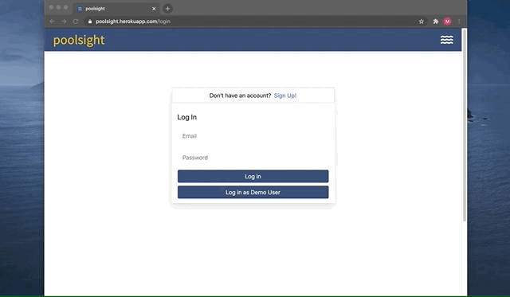

## 

 

**<a href="https://poolsight.herokuapp.com/">poolsight</a>** is a client-management platform for business owners in the pool service industry

 

### Languages and Technologies

---

<h5>Font End</h5>

<h5>Back End</h5>

<h5>Deployment and Package Management</h5>

 
 

### Features

---

As a poolsight user, you will be able to:

- Add clients to your account, including relevant pool details
- Easily access relevant client information in a single client profile page
- Create new repairs and keep track of all related tasks
- Mark tasks complete as you progress through each repair
- View your routes organized by service day, including any pending tasks, in your Dashboard
- Search for your clients, client pools, as well as repairs

### Dashboard/Client View:

<!-- #### Bonus Features

- Role-based accounts (owner vs technician)
- Map and report visualization
- Reminders -->

 
 

### Database Schema

---

### Routes

---

#### Backend Routes

##### Users API

| HTTP Verb | Route                     | Function                             |
| :-------- | :------------------------ | :----------------------------------- |
| GET       | `/api/users/`             | user authentication                  |
| POST      | `/api/users/login`        | user log in                          |
| GET       | `/api/users/logout`       | user log out                         |
| POST      | `/api/users/signup`       | user signup / log in                 |
| GET       | `/api/users/unauthorized` | Returns unauthorized when auth fails |

##### Clients API

| HTTP Verb | Route                      | Function                                  |
| :-------- | :------------------------- | :---------------------------------------- |
| GET       | `/api/clients/<user_id>`   | Get all clients for an authenticated user |
| GET       | `/api/clients/<client_id>` | Get a specific client                     |
| POST      | `/api/clients/`            | Create a client                           |
| PUT       | `/api/clients/<client_id>` | Edit a client's information               |
| DELETE    | `/api/clients/<client_id>` | Delete a specific client                  |

##### Repair API

| HTTP Verb | Route                     | Function                                        |
| :-------- | :------------------------ | :---------------------------------------------- |
| GET       | `/api/repair/<user_id>`   | Get all repair events for an authenticated user |
| GET       | `/api/repair/<client_id>` | Get all repair events for a specific client     |
| POST      | `/api/repair/`            | Create a repair event                           |
| PUT       | `/api/repair/<repair_id>` | Edit a repair event's information               |
| DELETE    | `/api/repair/<repair_id>` | Delete a specific repair event                  |

##### Task API

| HTTP Verb | Route                   | Function                            |
| :-------- | :---------------------- | :---------------------------------- |
| GET       | `/api/task/<repair_id>` | Get all tasks for a specific repair |
| POST      | `/api/task/<repair_id>` | Create a task for a repair          |
| PUT       | `/api/task/<task_id>`   | Edit a task's information           |
| DELETE    | `/api/task/<task_id>`   | Delete a specific task              |

##### Equipment API

| HTTP Verb | Route                           | Function                                |
| :-------- | :------------------------------ | :-------------------------------------- |
| GET       | `/api/equipment/<client_id>`    | Get all equipment for a specific client |
| POST      | `/api/equipment/<client_id>`    | Create equipment for a client           |
| PUT       | `/api/equipment/<equipment_id>` | Edit client equipment information       |
| DELETE    | `/api/equipment/<equipment_id>` | Delete a specific equipment event       |

#### Frontend Routes

| Route                              | Description                                              |
| :--------------------------------- | :------------------------------------------------------- |
| `/` Home/Splash (logged out users) | Splash/home page for visitors that are not authenticated |
| `/` Dashboard (logged in users)    | Dashboard for authenticated users                        |
| `/login`                           | Login form                                               |
| `/signup`                          | Signup form                                              |
| `/clients/:clientId`               | Client profile page                                      |
| `/repair/:repairId`                | Renders repair details of a specific repair event        |
| `/repair/create`                   | Create a repair event for a specific client              |
| `/task/create`                     | Create a task event for a specific client                |

### Component List

---

- Navbar
- Home/Dashboard
- Login form
- Signup form
- Client cards
- Client summary
- Repair cards
- Task cards
