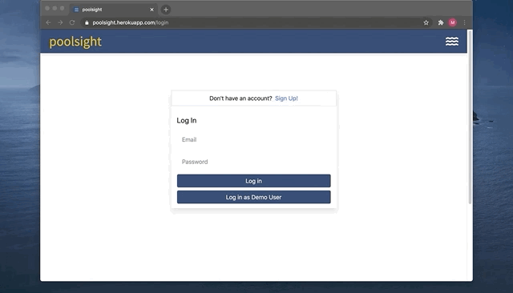

<a href="https://poolsight.herokuapp.com/"></a>

**<a href="https://poolsight.herokuapp.com/">poolsight</a>** is a client-management platform for business owners in the pool service industry

<br>

### Languages and Technologies

---

<h5>Font End</h5>
<a href="#"></a>
<a href="https://reactjs.org/"></a>
<a href="https://redux.js.org/"></a>
<a href="#"></a>
<a href="https://tailwindcss.com/"></a>
<h5>Back End</h5>
<a href="#"></a>
<a href="https://flask.palletsprojects.com/en/1.1.x/"></a>
<a href="https://www.postgresql.org/"></a>
<h5>Deployment and Package Management</h5>
<a href="https://heroku.com/"></a>
<a href="https://docker.com/"></a>
<a href="#"></a>
<a href="https://www.npmjs.com/"></a>

<br>
<br>

### Features

---

As a poolsight user, you will be able to:

- Add clients to your account, including relevant pool details
- Easily access relevant client information in a single client profile page
- Create new repairs and keep track of all related tasks
- Mark tasks complete as you progress through each repair
- View your routes organized by service day, including any pending tasks, in your Dashboard
- Search for your clients, client pools, as well as repairs

#### Dashboard/Client View:



#### Search clients, client pools, repairs:


<!-- #### Bonus Features

- Role-based accounts (owner vs technician)
- Map and report visualization
- Reminders -->

<br>

### Usage

1. Clone this repository (only this branch)

   ```bash
   git clone https://github.com/memg92/poolsight.git
   ```

2. Install dependencies

   ```bash
   pipenv install --dev -r dev-requirements.txt && pipenv install -r requirements.txt
   ```

3. Create a **.env** file based on the example with proper settings for your
   development environment
4. Setup your PostgreSQL user, password and database and make sure it matches your **.env** file

5. Get into your pipenv, migrate your database, seed your database, and run your flask app

   ```bash
   pipenv shell
   ```

   ```bash
   flask db upgrade
   ```

   ```bash
   flask seed all
   ```

   ```bash
   flask run
   ```

6. To run the React App in development, checkout the [README](./react-app/README.md) inside the `react-app` directory.

---

_IMPORTANT!_
If you add any python dependencies to your pipfiles, you'll need to regenerate your requirements.txt before deployment.
You can do this by running:

```bash
pipenv lock -r > requirements.txt
```

_ALSO IMPORTANT!_
psycopg2-binary MUST remain a dev dependency because you can't install it on apline-linux.
There is a layer in the Dockerfile that will install psycopg2 (not binary) for us.

---
