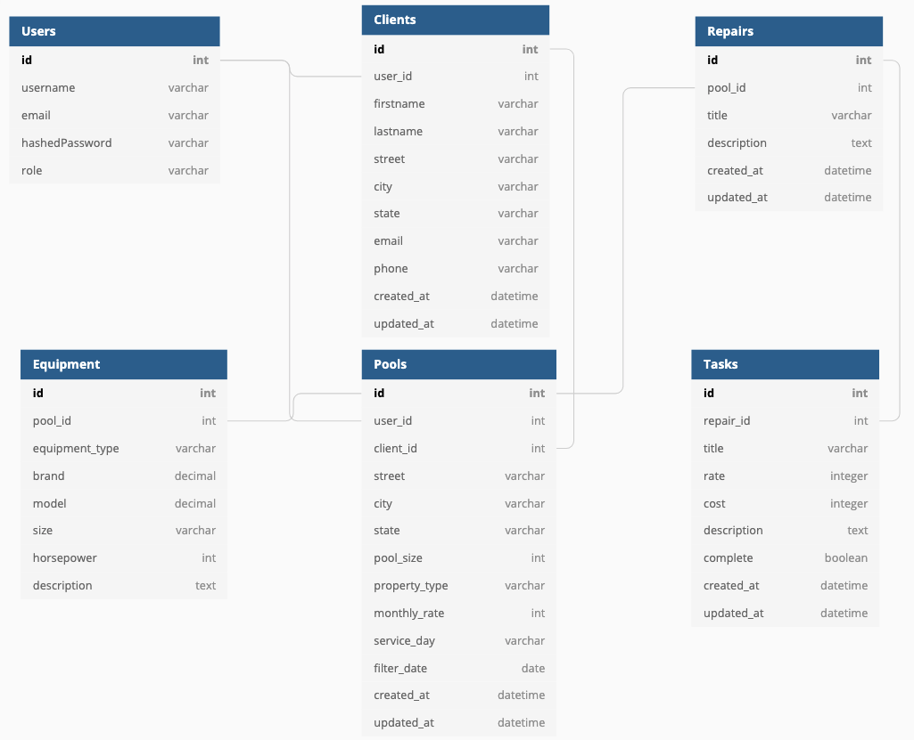

# poolsight

poolsight is a client-management application for business owners in the pool service industry

### MVP

---

- Clients
- Repairs
- Search
- Reporting

#### Bonus Features

- Role-based accounts (owner vs technician)
- Map and report visualization
- Reminders

### Database Schema

---

### Technologies Used

---

- React
- Redux
- Flask
- SQLAlchemy
- Tailwind CSS

### Routes

---

#### Backend Routes

##### Users API

| HTTP Verb | Route                     | Function                             |
| :-------- | :------------------------ | :----------------------------------- |
| GET       | `/api/users`              | user authentication                  |
| POST      | `/api/users/login`        | user log in                          |
| GET       | `/api/users/logout`       | user log out                         |
| POST      | `/api/users/signup`       | user signup / log in                 |
| GET       | `/api/users/unauthorized` | Returns unauthorized when auth fails |

#### Clients API

| HTTP Verb | Route                      | Function                                  |
| :-------- | :------------------------- | :---------------------------------------- |
| GET       | `/api/clients/<user_id>`   | Get all clients for an authenticated user |
| GET       | `/api/clients/<client_id>` | Get a specific client                     |
| POST      | `/api/clients/`            | Create a client                           |
| PUT       | `/api/clients/<client_id>` | Edit a client's information               |
| DELETE    | `/api/clients/<client_id>` | Delete a specific client                  |

#### Repair API

| HTTP Verb | Route                     | Function                                        |
| :-------- | :------------------------ | :---------------------------------------------- |
| GET       | `/api/repair/<user_id>`   | Get all repair events for an authenticated user |
| GET       | `/api/repair/<client_id>` | Get all repair events for a specific client     |
| POST      | `/api/repair/`            | Create a repair event                           |
| PUT       | `/api/repair/<repair_id>` | Edit a repair event's information               |
| DELETE    | `/api/repair/<repair_id>` | Delete a specific repair event                  |

#### Task API

| HTTP Verb | Route                   | Function                            |
| :-------- | :---------------------- | :---------------------------------- |
| GET       | `/api/task/<repair_id>` | Get all tasks for a specific repair |
| POST      | `/api/task/<repair_id>` | Create a task for a repair          |
| PUT       | `/api/task/<task_id>`   | Edit a task's information           |
| DELETE    | `/api/task/<task_id>`   | Delete a specific task              |

#### Equipment API

| HTTP Verb | Route                           | Function                                |
| :-------- | :------------------------------ | :-------------------------------------- |
| GET       | `/api/equipment/<client_id>`    | Get all equipment for a specific client |
| POST      | `/api/equipment/<client_id>`    | Create equipment for a client           |
| PUT       | `/api/equipment/<equipment_id>` | Edit client equipment information       |
| DELETE    | `/api/equipment/<equipment_id>` | Delete a specific equipment event       |

#### Frontend Routes

| Route                              | Function                                                 |
| :--------------------------------- | :------------------------------------------------------- |
| `/` Home/Splash (logged out users) | Splash/home page for visitors that are not authenticated |
| `/` Dashboard (logged in users)    | Dashboard for authenticated users                        |
| `/login`                           | Login form                                               |
| `/signup`                          | Signup form                                              |

### Component List

---

- Navbar
- Home/Dashboard
- Login form
- Signup form
- Client cards
- Client summary
- Repair cards
- Task cards
